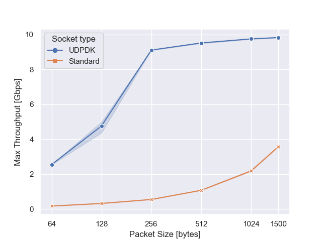

# UDPDK


***UDPDK*** is a minimal [**UDP**](https://tools.ietf.org/html/rfc768) stack based on [**DPDK**](https://www.dpdk.org/) for fast point-to-point communication between servers.  
It runs completely in userspace, so that you can move your packets quickly without going through the cumbersome kernel stack.  
Moreover, thanks to its POSIX-like API, porting existing applications to UDPDK is dead easy!<sup>1</sup>

**What UDPDK is:**
- A transport-level network stack
- A POSIX-like implementation of UDP sockets on top of DPDK
- A framework for low-latency packet exchanging

**What UDPDK is NOT:**
- A complete IP stack
- A mechanism to interconnect large networks nodes
- A software running on low-end consumer NICs 

<sup>1</sup>*Some features may be unsupported yet.*

Table of Contents
=================

   * [UDPDK](#udpdk)
      * [Requirements](#requirements)
      * [Install Dependencies](#install-dependencies)
      * [Install UDPDK](#install-udpdk)
      * [API](#api)
      * [Examples](#examples)
      * [How it works](#how-it-works)
      * [License](#license)
      * [Contributing](#contributing)

## Requirements

In order to use UDPDK, your machines must be equipped with DPDK-enabled NICs; these are typically found in servers, not in laptops and desktop machines.
The list of hardware officially supported by DPDK is available [here](https://core.dpdk.org/supported/). Specifically, UDPDK has been developed and tested on *Intel X710-DA2* with *igb_uio* and *vfio* drivers; other devices may still work, possibly with minor changes to the framework.

## Install Dependencies

UDPDK requires:
- DPDK 20.05
- inih (any)

They are already included in this repository as submodules, so pull them:
```
git submodule init
git submodule update
```

**DPDK**

[DPDK](dpdk.org) is the pivotal element of UDPDK. It manages the NIC and implements Ethernet.
```
cd dpdk/usertools
./dpdk-setup.sh
```
From the menu, do the following:
1. Compile for your specific arch, usually `x86_64-native-linuxapp-gcc`
2. Load the `vfio` module
3. Configure hugepages (e.g. 1024M for each NUMA node)
4. Bind the NIC to vfio driver, specifying its PCI address

**inih**

[inih](https://github.com/benhoyt/inih) is used for convenience to parse `.ini` configuration files.
```
cd inih
meson build
cd build
ninja
```

## Build and install UDPDK

UDPDK builds into a static library, which eventually needs to be linked with the final application.

```
cd udpdk
make
sudo make install
```

## API

The API of UDPDK closely resembles that of good old BSD sockets:

```
int udpdk_socket(int domain, int type, int protocol);
int udpdk_bind(int s, const struct sockaddr *addr, socklen_t addrlen);
int getsockopt(int sockfd, int level, int optname, void *optval, socklen_t *optlen);
int setsockopt(int sockfd, int level, int optname, const void *optval, socklen_t *optlen);
ssize_t udpdk_sendto(int sockfd, const void *buf, size_t len, int flags, const struct sockaddr *dest_addr, socklen_t addrlen);
ssize_t udpdk_recvfrom(int s, void *buf, size_t len, int flags, struct sockaddr *src_addr, socklen_t *addrlen);
int udpdk_close(int s);
```

In addition, the following methods are required for the proper setup and teardown of DPDK internals (structures and processes):
```
int udpdk_init(int argc, char *argv[]);
void udpdk_interrupt(int signum);
void udpdk_cleanup(void);
```

*Note: select() is not implemented yet*

## Examples

The `apps/` folder contains two simple examples: a [ping-pong](apps/pingpong) and a [pkt-gen](apps/pktgen) application.

## How it works

UDPDK runs in two separate processes: the primary is the one containing the application logic (i.e. where syscalls are called), while the secondary (*poller*) continuously polls the NIC to send and receive data. The packets are exchanged between the application and the poller through shared memory, using lockless ring queues.

## Performance

We compare UDPDK against standard UDP sockets in terms of throughput and latency.

**Environment**  

Two identical servers are connected point-to-point on a 10G interface. Their specs are:

*CPU:* Intel Xeon E5-2640 @2.4GHz  
*RAM:* 64GB  
*OS:* Ubuntu 18.04  
*Kernel:* 4.15.0  
*NIC:* Intel X710 DA2 10GbE  
*NIC driver:* VFIO (DPDK) or i40e (normal sockets)

**Throughput**

We measure the maximum throughput achieved varying the packet size.  
The latter is inclusive of the UDP, IP and MAC headers.

As shown in the picture, UDPDK is up to **18x better** than traditional sockets.  
It should be noted that UDPDK saturates the 10G connection, which unfortunately is all we had: a 40G inferface would make it definitely shine!



**Latency**

We measure the latency and its jitter.  
Again, UDPDK proves to be an order of magnitude better than standard sockets.

| | UDPDK | Standard |
| --- | --- | --- |
*Mean (μs)* | 13.92 | 116.57 |
*Std (μs)*  | 0.74 | 18.49 |

## License

UDPDK is released under [BSD 3-Clause license](LICENSE).

## Contributing

Everyone is more than welcome to contribute to UDPDK by implementing new features, extending existing ones or simply reporting bugs/issues.
