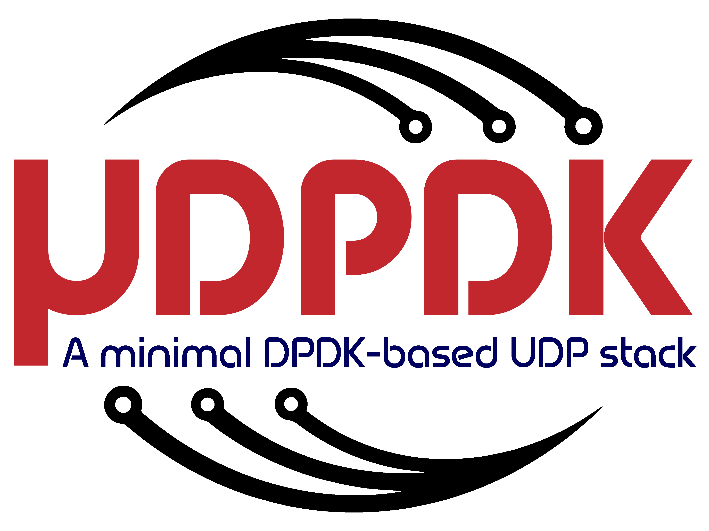

# UDPDK



***UDPDK*** is a minimal [**UDP**](https://tools.ietf.org/html/rfc768) stack based on [**DPDK**](https://www.dpdk.org/) for fast point-to-point communication.  
It represents the ideal solution if you want to quickly move packets between two hosts, bypassing the cumbersome kernel stack, yet without disruptive changes to the existing application logic.  
Indeed, thanks to its POSIX-like API, porting existing applications is usually as simple as renaming a couple of functions<sup>1</sup>.

**What UDPDK is:**
- A transport-level network stack
- A POSIX-like implementation of UDP sockets over DPDK
- A framework for low-latency packet exchanging for critical applications

**What UDPDK is NOT:**
- A complete IP stack
- A mechanism to interconnect large networks nodes
- A software running on low-end NICs 

<sup>1</sup>*Some options may be unsupported yet.*

Table of Contents
=================

   * [UDPDK](#udpdk)
      * [Requirements](#requirements)
      * [Install Dependencies](#install-dependencies)
         * [DPDK](#dpdk)
         * [inih](#inih)
      * [Install UDPDK](#install-udpdk)
      * [License](#license)
      * [Contributing](#contributing)

## Requirements

In order to use UDPDK, your machines must be equipped with DPDK-enabled NICs; these are typically found in servers, not in laptops and desktop machines.
The list of hardware officially supported by DPDK is available [here](https://core.dpdk.org/supported/). Specifically, UDPDK has been developed and tested on *Intel X710-DA2* with *i40e* driver; other devices may still work with minor changes to the framework.

## Install Dependencies

UDPDK requires:
- DPDK 20.05
- inih (any)

They are already included in this repository as submodules, so pull them:
```
git submodule init
git submodule update
```

### DPDK

[DPDK](dpdk.org) is the pivotal element of UDPDK. It manages the NIC and implements Ethernet.
```
cd dpdk/usertools
./dpdk-setup.sh
```
From the menu, do the following:
1. Compile for your specific arch, usually `x86_64-native-linuxapp-gcc`
2. Load the `vfio` module
3. Configure hugepages (e.g. 1024M for each NUMA node)
4. Bind the NIC to vfio driver, specifying its PCI address

### inih

[inih](https://github.com/benhoyt/inih) is used for convenience to parse `.ini` configuration files.
```
cd inih
meson build
cd build
ninja
```

## Install UDPDK

UDPDK builds into a static library, which eventually needs to be linked with the final application.

```
cd udpdk
make
sudo make install
```

## License

UDPDK is released under [BSD 3-Clause license](LICENSE).

## Contributing

Everyone is more than welcome to contribute to UDPDK by implementing new features, extending existing ones or simply reporting bugs/issues.
